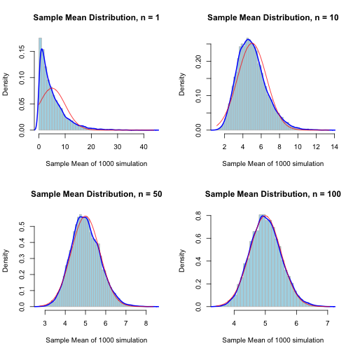

## Classical CLT:

Let $X_1, X_2, ...$ be iid's with mean $\mu$ and finite variance $\sigma^2$. Then $ \frac{X_1 + \cdots + X_n - n\mu}{\sqrt n} $ converges in distribution to a normal $N(0, \sigma^2)$.

## Exponential Distribution

The PDF of an exponential distribution is defined by $f(x) = \lambda e^{-\lambda x}$, where $\lambda$ is the rate parameter, $x>0$. This has mean $1/\lambda$ and variance $1/\lambda^2$.

--- .class #id  

## Shiny App's Description
In this shiny app, we 
* Choose the number $n$ and $\lambda$. 
* Generate $n$ values from Exp$(\lambda)$, using R's rexp function.
* Take the mean of $n$ values to get $$X = \frac{X_1+...+ X_n}{n}$$ 
* Make density plot with 10000 such values.
* Compare with the density plot of $N(\mu, \frac{\sigma^2}{n})$.

---

## Plot Results

---

## Conclusion
* With $n$ increasing, the shape of the density plot resembles a bell curve which is exactly a normal distribution.

* From this demonstration, we deduce that if $n$ increases then $$ \sqrt n \left(\left( \frac{1}{n} \sum_{i=1}^n X_i \right)  - \mu \right)\xrightarrow{d} \mathcal N(0,\sigma ^2).$$

Here $d$ means that the cumulative function of the left side converges pointwise to the CDF of $\mathcal{N}(0,\sigma^2).$ 

